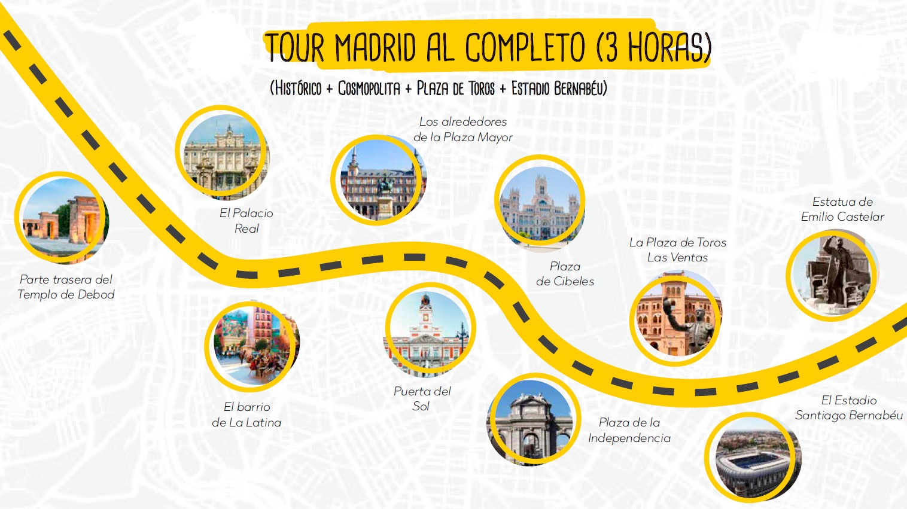

<script> 
    $(document).ready(function() { 
    $head = $('#header'); 
    $head.prepend('<A href = https://www.cuttingedge-events.com></A>') 
    }); 
</script> 

<style>

.precio{
background-color:#828282;
color: white;
padding: 10px;
border: 1px solid black;
margin-left: 5px;
border-radius: 5px;
font-style: italic;
}
</style>


<style>
.list-group-item.active, .list-group-item.active:focus, .list-group-item.active:hover {
    background-color: #EA5933;
}
</style>

<style>
.nav>li>a {
    position: relative;
    display: block;
    padding: 10px 15px;
    color: #EA5933;
    font-weight: bold;
}
.nav-pills>li.active>a, .nav-pills>li.active>a:hover, .nav-pills>li.active>a:focus {
    color: white;
    background-color: #EA5933;
}

</style>


```{r setup, include=FALSE}
knitr::opts_chunk$set(echo = FALSE, message=FALSE, warning=FALSE)
```


```{r libraries}
library(readxl)
library(dplyr)
library(knitr)
library(timevis)

```


# Introduccón

Siguiendo su petición, a continuación le presentamos:

* Restaurantes de comida tradicional situados en el centro de la ciudad, en los que podrá disfrutar de comida de alta calidad cocinada "según las recetas de nuestros abuelos"
  
* Restaurantes vanguardistas, jóvenes...con una atmósfera especial, pero sin olvidar nunca la buena comida.
  
* Una opción de cena más espectáculo flamenco.
  
* Actividades de medio dia que se realizan en la ciudad de Madrid y nos explican parte de su "alma"
  
* Excursion fuera de Madrid incluyendo almuerzo, en las que podrán disfrutar de la historia y la gastronomía de la zona.


<br>
<br>

# Mapa

En este mapa se muestra la localización de los restaurantes que recomendamos.

<iframe src="https://www.google.com/maps/d/embed?mid=1MehcDD59VY7q1IDua2r0fcbKbDE2CJ_c&hl=es" width="100%" height="550"></iframe>


# Restaurantes Tradicionales 

## Casa Gallega


<iframe src="CasaGallega/CasaGallegaCast.html"  frameborder="0" width="100%" height="1050" scrolling="no"></iframe>

<div class="precio">

<p> PRECIOS: 
  <ul>
  
* Menu básico compuesto de entrantes a compartir, plato principal a elegir entre carne y pescado, postre casero, incluyendo bebida (1 botella de vino cada 3 pax, agua y café) desde: 62,50€ IVA inc


  </ul>
</p>
</div>


<br>
<br>


## OPulpo


<iframe src="Opulpo/opulpocast.html"  frameborder="0" width="100%" height="1050" scrolling="no"></iframe>

<div class="precio">
<p> PRECIOS: 
  <ul>
  
* Menu básico compuesto de entrantes a compartir, plato principal a elegir entre carne y pescado, postre casero, incluyendo bebida (1 botella de vino cada 3 pax, agua y café) desde: 44€ IVA inc

  </ul>
</p>
</div>


<br>
<br>

## Casa Alberto


<iframe src="CasaAlberto/CasaAlbertoCast.html"  frameborder="0" width="100%" height="1600" scrolling="no"></iframe>

<div class="precio">
<p> PRECIOS: 
  <ul>
  
* Menu básico compuesto de entrantes a compartir, plato principal a elegir entre carne y pescado, postre casero, incluyendo bebida (1 botella de vino cada 2 pax, agua y café) desde: 44€ IVA inc

  </ul>
</p>
</div>

<br>
<br>


## Meson Txistu

El mesón tiene salones privados de difererentes tamaños, desde 46 a 150 pax en un solo salón.

<iframe src="Meson Txistu/MesonTxistuCast.html"  frameborder="0" width="100%" height="1050" scrolling="no"></iframe>

<div class="precio">
<p> PRECIOS: 
  <ul>
* Menu básico compuesto de entrantes a compartir, plato principal a elegir entre carne y pescado, postre casero, incluyendo bebida (1 botella de vino cada 2 pax, agua y café) desde: 75,50€ IVA inc
   </ul>
</p>
</div>

<br>
<br>

## La Barraca

<iframe src="LaBarraca/LaBarracaCast.html"  frameborder="0" width="100%" height="1100" scrolling="no"></iframe>

<div class="precio">
<p> PRECIOS: 
  <ul>
* Menu básico compuesto de entrante, plato principal (paella), postre, incluyendo bebida (1 botella de vino cada 3 pax, agua y café) desde: 52,50€ IVA inc
   </ul>
</p>
</div>

<br>
<br>


# Restaurantes Especiales

## Ana La Santa

<iframe src="AnaLaSanta/AnaLaSantaCast.html"  frameborder="0" width="100%" height="1030" scrolling="no"></iframe>

<div class="precio">
<p> PRECIOS: 
  <ul>
* Menu básico compuesto por entrantes a compartir, principal a elegir entre carne y pescado, postre, incluyendo bebida (1 botella de vino cada 3 pax, agua y café) desde: 67,50€ IVA inc
   </ul>
</p>
</div>

<br>
<br>


## Habanera

<iframe src="Habanera/HabaneraCast.html"  frameborder="0" width="100%" height="1000" scrolling="no"></iframe>

<div class="precio">
<p> PRECIOS: 
  <ul>
* Menu básico compuesto por entrantes a compartir, principal a elegir entre carne y pescado, postre, incluyendo bebida (1 botella de vino cada 3 pax, agua y café) desde: 69€ IVA inc
   </ul>
</p>
</div>

<br>
<br>


## Mucca de Prado


<iframe src="LaMuccadePrado/LaMuccadePradoCast.html"  frameborder="0" width="100%" height="1100" scrolling="no"></iframe>

<div class="precio">
<p> PRECIOS: 
  <ul>
* Menu básico compuesto platos servidos al centro para compartir, incluyendo bebida (1 botella de vino cada 3 pax, agua y café) desde: 44€ IVA inc
   </ul>
</p>
</div>

<br>
<br>


## El Imparcial


<iframe src="Imparcial/ImparcialCast.html"  frameborder="0" width="100%" height="1100" scrolling="no"></iframe>

<div class="precio">
<p> PRECIOS: 
  <ul>
* Menu básico compuesto entrantes a compartir, principal a elegir entre carne y pescado, incluyendo bebida (1 botella de vino cada 3 pax, agua y café) desde: 48€ IVA inc
   </ul>
</p>
</div>

<br>
<br>

# Cena y Flamenco 

## Tablao Villa Rosa

Situado en la céntrica Plaza de Santa Ana encontramos el Tablao Villa Rosa, el más antiguo de Madrid.
Fue inagurado en 1911 y tras varias transformaciones, en 1919 lograron desarrollar un concepto nuevo para el momento: restaurante con espectáculo en Madrid con alma flamenca.


En Villa Rosa podemos encontrar una variada propuesta gastronómica ofreciendo los platos más representativos de la cocina española y especialmente la andaluza.

La Estructura del teatro flamenco se articula bajo un entramado de columnas inspidados en la Alhambra de Granada. El ambiente se envuelve bajo las escenas taurinas y flamencas de azulejos que se conservan desde la inauguración del tablao.


<br>


<div class="precio">

<p> PRECIOS: 
  <ul>
  
* Menu básico de tres platos, incluyendo 1 bebida, desde(incluyendo el espectáculo): 66,50€ IVA inc.

* Barra libre de cerveza, vino y sangría 2 horas (durante la cena): 16,50€ IVA inc

* Café o te: 2,5€ IVA inc

  </ul>
</p>
</div>


# Actividades en Madrid 

## Santiago Bernabeu

<iframe src="https://uploads.knightlab.com/storymapjs/ee2f18a9c1765fc1a4086f419505950c/tour-santiago-bernabeu/index.html" frameborder="0" width="100%" height="900"></iframe>

<div class="precio">
<p> PRECIOS: 
  <ul>
* Guía oficial para tour guiado por la ciudad (4h): 260€ IVA inc
  
* Entrada al Estadio incluyendo visita a museo y sala audiovisual: 38,50€ IVA inc por persona
  
* Bus de 16 plazas a disposición 4h para la visita: 250€ IVA inc
  
   </ul>
</p>
</div>

<br>
<br>

## Las Ventas

<iframe src="https://uploads.knightlab.com/storymapjs/ee2f18a9c1765fc1a4086f419505950c/las-ventas/index.html" frameborder="0" width="100%" height="800"></iframe>

<div class="precio">
<p> PRECIOS: 
  <ul>
* Visita guiada a la plaza de toros (1h30minutos): 330€  IVA inc todo el grupo hasta 11 personas 
  
* Se puede añadir al tour la opción de disfrutar de los juegos virtuales (grupos hasta 10 personas - 40 minutos):150€ IVA inc
  
* Bus de 16 plazas a disposición 4h para la visita: 250€ IVA inc
  
   </ul>
</p>
</div>

<br>
<br>


## Tour de Tapas

<iframe src="https://uploads.knightlab.com/storymapjs/ee2f18a9c1765fc1a4086f419505950c/tour-de-tapas/index.html" frameborder="0" width="100%" height="1000"></iframe>

<div class="precio">
<p> PRECIOS: 
  <ul>
  
* Guía oficial para el tapas tour (maximo 4h): 260€ IVA inc
  
* 3 Paradas de Tapas incluyendo 6 tapas y 3 bebidas en total: 45€ IVA inc por persona *(se puede ampliar el número de tapas bajo petición)*
  
* Bus de 16 plazas a disposición 4h para la visita: 250€ IVA inc
  
   </ul>
</p>
</div>

<br>

*El tour se realizará caminando por el centro pero necesitarán el bus para ir/volver desde el hotel hasta el punto de inicio*


<br>
<br>


## Palacio Real Madrid

<iframe src="https://uploads.knightlab.com/storymapjs/ee2f18a9c1765fc1a4086f419505950c/visita-palacio-real-de-madrid/index.html" frameborder="0" width="100%" height="800"></iframe>

<div class="precio">
<p> PRECIOS: 
  <ul>
* Bus de 16 plazas a disposición 4h para la visita: 250€ IVA inc
  
* Guía oficial para tour por Madrid (4h): 260€ IVA inc
  
* Entrada al Palacio Real incluyendo auriculares: 15€ IVA inc por persona.
   </ul>
</p>
</div>

<br>
<br>

## Madrid secreta

<iframe src="https://uploads.knightlab.com/storymapjs/ee2f18a9c1765fc1a4086f419505950c/teleferico-y-estacion-de-4-caminos/index.html" frameborder="0" width="100%" height="800"></iframe>

<div class="precio">
<p> PRECIOS: 
  <ul>
* Bus de 16 plazas a disposición 4h para la visita: 250€ IVA inc
  
* Guía oficial para tour por Madrid (4h): 260€ IVA inc
  
* Tickets para el teleferico: 10€ por persona IVA inc
   </ul>
</p>
</div>

<br>
<br>

## Tour en biplaza



Tour de 3 horas comenzando y terminando en el Templo de  Debod, los invitados conducen sus propios biplazas guiados por un GPS en el que está programada la ruta. El mismo GPS es el que dará las explicaciones sobre los lugares destacados tal y como El Palacio Real, la PlazaMayor, La Gran via, etc.

<div class="precio">
<p> PRECIOS: 
  <ul>
* Bus de 16 plazas a disposición 4h: 250€ IVA inc
  
* 3 horas de actividad, incluyendo 1 coche por cada 2 personas, seguro de  responsabilidad civil y de accidentes, Audioguia/GPS en varios idiomas: 85€ por persona IVA inc
   </ul>
</p>
</div>

*Seguro para cubrir daños por colisión con franquicia de 300€ + IVA por coche*

*Se requiere un depósito de 1.200€ como garantía que será inmediatamente abonado al finalizar el evento*

<br>


<br>
<br>

# Excursión día completo

## Toledo 

<iframe src="https://uploads.knightlab.com/storymapjs/ee2f18a9c1765fc1a4086f419505950c/toledo-full-day-tour/index.html" frameborder="0" width="100%" height="800"></iframe>

<div class="precio">
<p> PRECIOS: 
  <ul>
* Bus de 16 plazas a disposición 8h para la visita a Toledo: 470€ IVA inc
  
* Guía oficial para hacer la excursión saliendo de Madrid con el grupo y haciendo tour por Toledo a pie: 380€ IVA inc 
  
* Almuerzo en Alfileritos 24 - menu compuesto de 3 platos incluyendo bebida y café, desde: 46,50€ por persona IVA inc
  
* Entrada a la Catedral de Toledo 15€ IVA inc por persona.
   </ul>
</p>
</div>

<br>

*En sábados o festivos, el precio del guía incrementará un 20%*

<br>
<br>


# Condiciones

  * Precios netos para CuatroF
  
  * Los honorarios de Cutting Edge Events está incluido en los precios
  
  * Todos los precios incluyen IVA 
  
  * No se ha realizado ninguna reserva. Una vez confirmado se comprobará la disponibilidad.

<br>
<br>

## Sorprendan a sus clientes!!

<div class="client_offer">

<p>¿Les ha gustado nuestra presentación? La meta principal de _**CUTT/events**_ es ayudarles a **ganar** este negocio. Seguramente ahora copiarían toda la información que contiene esta web y harían su propia presentación.<br>

<p>Pero...¿porqué no utilizar nuestra tecnología y presentar esta propuesta a su cliente en nuestro formato? Ahora les ofrecemos, como un servicio **totalmente gratuito**, la posibilidad de poder sorprender a sus clientes con su novedosa propuesta. </p>

<p> ¿Cómo lo hacemos?: 
  <ul>
  
* Seguimos sus instrucciones para añadir cualquier cosa que quiran que esté incluida en su presentación y borrar cualquier otra información que consideren irrelevante.
    
* Incluimos el logo e información de su empresa y eliminamos todos nuestros datos.
    
* Podemos incluso cambiar algunos de los colores para que se asemeje más a su imagen corporativa.
    
* Una vez finalizada le enviaremos un nuevo link que no tendrá ninguna referencia a Cutting Edge Events para que puedan enviarlo a sus clientes como una presentación propia.
  </ul>
</p>
</div>

<style>

.client_offer{
background-color: #ee7600;
color: white;
padding: 10px;
border: 1px solid black;
margin-left: 25px;
border-radius: 5px;
font-style: italic;
}
</style>

******************


